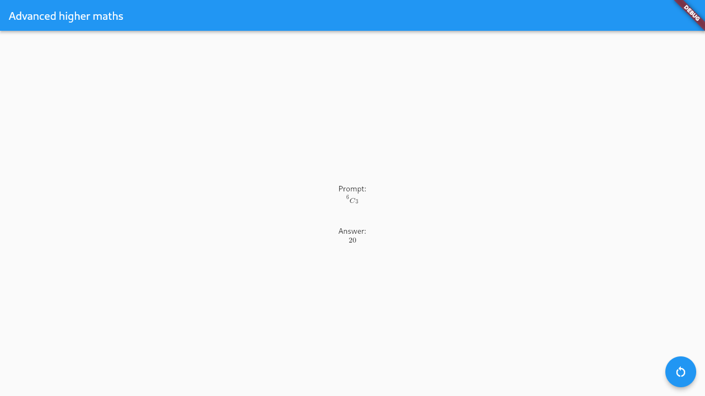

# Advanced higher maths

## ⚠️ Not maintained ⚠️

This has been put up more for interest than anything

## Description

An app that generates questions for Advanced higher maths. Advanced higher maths refers to the [Scottish qualification](https://www.sqa.org.uk/sqa/48507.html).
It is written with a Flutter/Dart frontend interoperating with a Rust backend through [flutter_rust_bridge](https://cjycode.com/flutter_rust_bridge/).

There are currently only 3 questions it can ask you so there's not much use for it other than pure curiosity. It is written more as an educational project for myself than one to be actually used.

## Screenshots

|  |  |  |
| -------------------------------------------- | ---------------------------------------------- | ------------------------------------------------------ |

## Running

If, for some unfathomable reason, you want to actually run this thing, you can just run (pun intended):

```
just run
```
